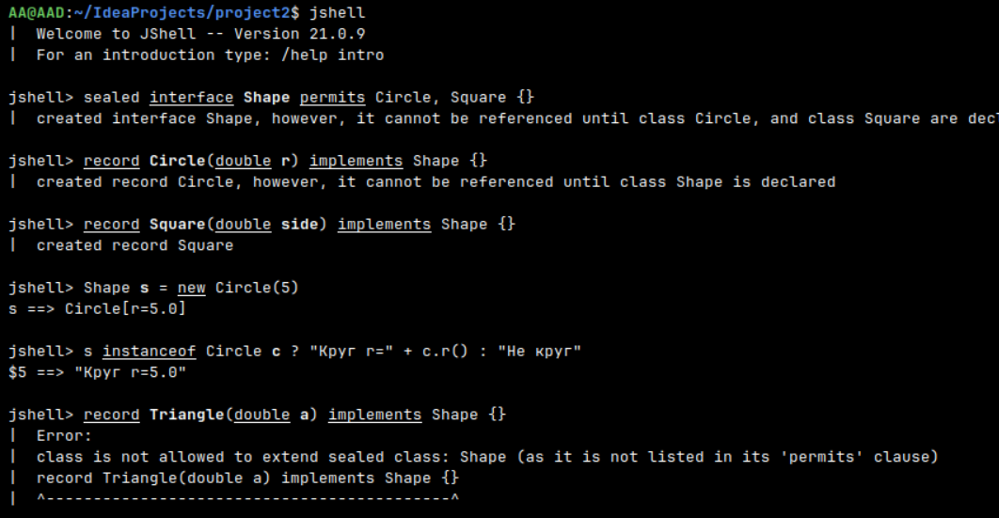

Почему это происходит?

Sealed-классы и интерфейсы (запечатанные типы) были введены в Java 17 для создания ограниченной иерархии наследования. 
Когда мы объявляем sealed interface мы явно указываем, что только перечисленные после ключевого слова permits классы (в 
данном случае Circle и Square) могут реализовывать этот интерфейс.

Основные правила sealed-типов:

Все разрешённые наследники должны быть явно перечислены в permits

Каждый разрешённый наследник должен напрямую расширять/реализовывать sealed-тип

Разрешённые наследники должны быть либо final, либо sealed, либо non-sealed

В нашем случае Triangle не указан в permits интерфейса Shape, поэтому компилятор не позволяет создать такой класс/record,
даже если он находится в том же файле/сессии.