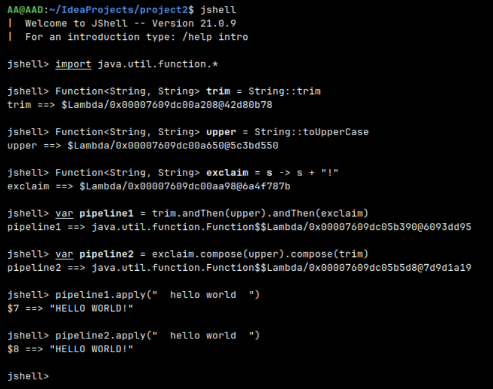

Да, в данном случае pipeline1 и pipeline2 дают одинаковый результат: "HELLO WORLD!"

Когда результаты будут различаться?

Результаты будут различаться, если функции не являются взаимозаменяемыми (некоммутативными). Например:

```
Function<Integer, Integer> add1 = x -> x + 1;
Function<Integer, Integer> mult2 = x -> x * 2;

// andThen: сначала +1, потом *2
add1.andThen(mult2).apply(5)  // (5+1)*2 = 12

// compose: сначала *2, потом +1  
add1.compose(mult2).apply(5)   // (5*2)+1 = 11
```

Ключевое отличие:

f.andThen(g) - сначала f, потом g

f.compose(g) - сначала g, потом f

В исходном примере функции trim, upper, exclaim коммутативны в том смысле, что порядок их применения не важен для конечного
результата (при условии, что они применяются в цепочке в одной последовательности). Поэтому andThen и compose дали одинаковый результат.