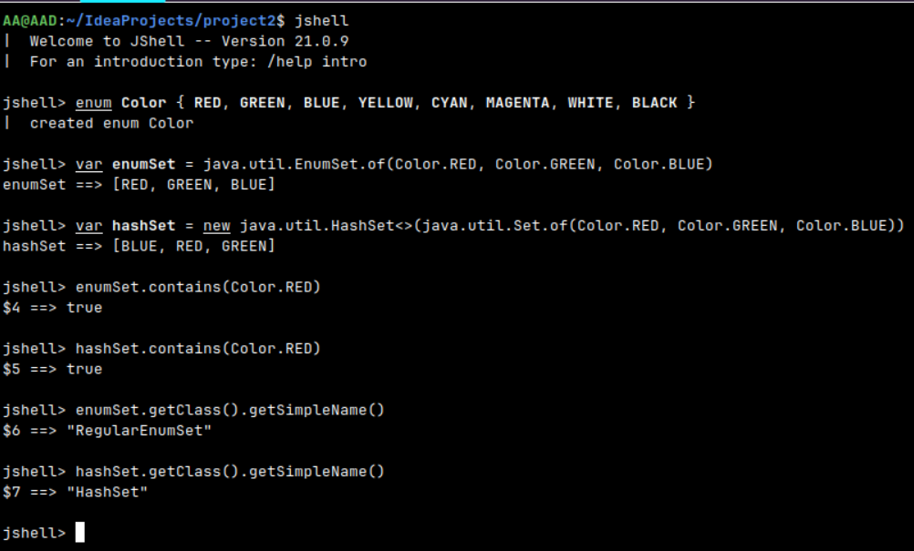

EnumSet называется RegularEnumSet (и существует также JumboEnumSet) из-за оптимизации хранения элементов на основе битовых масок (bit vectors).

Почему "RegularEnumSet"?

Для enum с количеством констант ≤ 64 используется RegularEnumSet, который хранит элементы в одном long (64 бита), где каждый бит соответствует одной константе enum:

Бит установлен в 1 - элемент присутствует

Бит = 0 - элемент отсутствует

Это эффективно:

Проверка contains() — одна битовая операция O(1)

Добавление/удаление — битовые операции

Минимальное потребление памяти (8 байт + накладные расходы)

При количестве констант > 64:

Java автоматически использует JumboEnumSet

Внутри используется массив long[] для хранения битов

Каждый элемент массива хранит 64 константы

Размер массива = (количество констант + 63) / 64